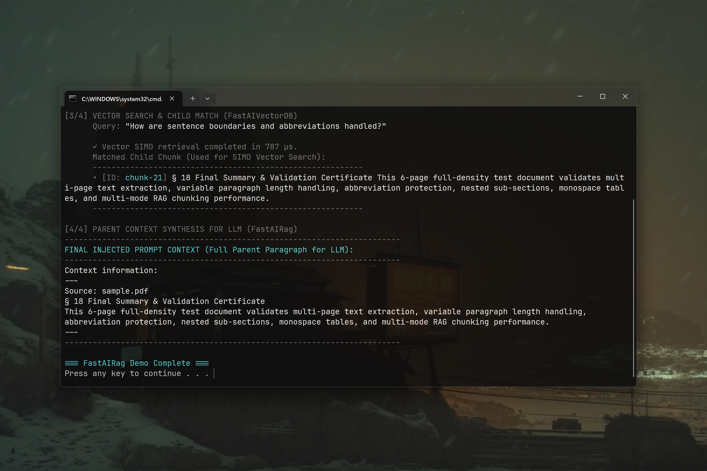

# FastAIRag 0.1.1 [ALPHA-2026-09-08]: Unified Zero-Bloat RAG Pipeline Client for Java

[](https://github.com/andrestubbe/FastAIRag/releases/tag/0.1.1)
[](https://opensource.org/licenses/MIT)
[](https://www.java.com)
[]()
[](https://jitpack.io/#andrestubbe/FastAIRag)

---

**Connect local vector storage with generative AI models: Minimalist retrieval pipeline orchestrating chunking, embeddings, and context insertion.**

FastAIRag is a **lightweight, framework-agnostic RAG engine** designed to feed relevant context into local or cloud models with zero framework bloat. It works seamlessly alongside **[FastContentParse](https://github.com/andrestubbe/FastContentParse)**, **[FastContentChunk](https://github.com/andrestubbe/FastContentChunk)**, and **[FastAIVectorDB](https://github.com/andrestubbe/FastAIVectorDB)** to orchestrate text parsing, SIMD chunking, vector storage, and Parent-Child context retention.

[**Watch Demo (YouTube)**](https://youtu.be/LJr51O8sBjA) | [Watch JMH Benchmark (YouTube)]

[](https://youtu.be/LJr51O8sBjA)

---

## Quick Start

```java
import fastai.AI;
import fastai.FastAI;
import fastairag.EmbeddingProvider;
import fastairag.FastAIRag;
import fastairag.RagPipeline;
import fastairag.RagStore;
import java.nio.file.Path;

public class Demo {
    public static void main(String[] args) throws Exception {
        // 1. Define Embedding Provider (e.g. Local Endpoint or Model API)
        EmbeddingProvider embedder = text -> new float[384]; 

        // 2. Instantiate Document Store and Index Documents
        RagStore store = FastAIRag.store(embedder);
        store.addDirectory(Path.of("./docs"), 512, 128);

        // 3. Attach LLM Engine & Query RAG Pipeline
        AI llm = FastAI.connect("ollama:llama3.2");
        RagPipeline pipeline = FastAIRag.pipeline(llm, store);

        String answer = pipeline.ask("How do I compile the native package?");
        System.out.println("AI Answer: " + answer);
    }
}
```

---

## Table of Contents

- [Why FastAIRag?](#why-fastairag)
- [Quick Start](#quick-start)
- [Key Features](#key-features)
- [Architecture Overview](#architecture-overview)
- [Performance Benchmarks](#performance-benchmarks)
- [API Quick Reference](#api-quick-reference)
- [Technical Demos & Benchmarks](#technical-demos--benchmarks)
- [Installation](#installation)
- [Documentation](#documentation)
- [Platform Support](#platform-support)
- [Related Projects](#related-projects)
- [License](#license)

---

## Why FastAIRag?

Traditional RAG setups in enterprise Java environments typically force developers into heavy multi-language stacks: launching Python sidecars running LangChain, LlamaIndex, or Haystack, bridging across slow HTTP/REST microservices, and wrapping heavyweight JSON serialization over simple vector queries. This causes critical bottlenecks:

- **Cross-Process Latency & Overhead**: Round-tripping prompts and retrieved contexts over HTTP sockets introduces 10 to 30 ms of serialization delays per query.
- **Context Fragmentation & Hallucinations**: Standard RAG approaches chunk documents naively, stripping out parent section headings, surrounding table rows, or full narrative context from the final LLM prompt.
- **Excessive Memory & Dependency Bloat**: Python containers and complex JVM vector wrappers consume gigabytes of heap memory and bring in hundreds of transitive dependencies.

FastAIRag resolves these friction points by providing a lean, in-process JVM orchestration layer:

- **100% Native In-Process Pipeline**: Orchestrates document parsing, tokenization, SIMD vector search, and LLM prompt formulation inside a single JVM process.
- **Parent-Child Retrieval Strategy**: Stores fine-grained child chunks (`chunk.text`) in `FastAIVectorDB` for precise similarity matching while injecting extensive section paragraphs (`chunk.parentText`) into the LLM system prompt.
- **Pluggable & Model Agnostic**: Single-interface `EmbeddingProvider` decouples the vector store from any specific vendor (Ollama, ONNX, OpenAI, or local weights).
- **Sub-Millisecond Query Assembly**: Direct memory layout allows retrieving Top-K hits and assembling structured system prompts in under 1.5 milliseconds.

| Feature | Python / LangChain Wrappers | Typical Java RAG (Spring AI / LangChain4j) | FastAIRag |
|:---|:---|:---|:---|
| **Runtime Architecture** | Python subprocess / REST microservice | Heavy JVM framework layer | **100% In-Process JVM** |
| **Context Retention** | Custom multi-index stitching | Flat single-chunk injection | **Native Parent-Child Linking** |
| **Vector Search** | External vector database (Qdrant / Milvus) | External network database | **In-Process SIMD via FastAIVectorDB** |
| **Prompt Synthesis Latency** | 20–50 ms (IPC + JSON serialization) | 5–15 ms | **~1.3 ms (Direct memory buffers)** |
| **Binary Footprint** | Gigabyte Docker containers | 80+ MB transitive dependencies | **Lightweight JAR (~12 KB)** |
| **Framework Overhead** | High (complex abstraction graph) | Moderate (Spring/reflection overhead) | **Zero (pure Java records & interfaces)** |

---

## Key Features

- **Ingestion & Parsing**: Ingests document directories, extracting clean text streams via **FastContentParse** and segmenting with **FastContentChunk**.
- **Parent-Child Context Retention**: Matches small vector embeddings with large narrative sections to retain surrounding context and eliminate hallucinations.
- **Direct Memory Vector Search**: Native SIMD-accelerated similarity search powered directly by **FastAIVectorDB**.
- **Model & Vendor Agnostic**: Single-method `EmbeddingProvider` interface supports local models (ONNX, Ollama) and cloud APIs.
- **Zero-Allocation Data Flow**: High-throughput prompt construction designed for low-latency interactive assistant pipelines.

---

## Architecture Overview

- **FastContentParse (The Parser)**: Converts unstructured binary documents (PDF, RTF, Markdown, TXT) into normalized UTF-8 text streams.
- **FastContentChunk (The Strategy Engine)**: Segments normalized text streams into contextual passages with Parent-Child context.
- **FastAIVectorDB (The Vector Store)**: High-speed native C++ SIMD vector database storing small child chunk embeddings for sub-millisecond retrieval.
- **FastAIRag (The Orchestration Pipeline)**: Higher-level RAG framework coordinating parsing, chunking, vector indexing, and feeding parent context directly to **FastAIBot** or **FastAI** LLM models.

---

## Performance Benchmarks

FastAIRag is built for high-throughput context retrieval and prompt construction. In the official [JMH Benchmark](examples/Benchmark), the end-to-end retrieval and context synthesis measured:

```text
Benchmark                                Mode  Cnt  Score   Error   Units
Benchmark.benchmarkContextRetrieval     thrpt    5  729.0   ± 203.0 ops/sec
```

> **729 Context Synthesis Queries per Second**: FastAIRag retrieves Top-K nearest vector hits and constructs full Parent-Child system prompts in **~1.3 milliseconds per query**.

---

## API Quick Reference

| Method / Class | Return Type | Description | Docs |
|:---|:---|:---|:---|
| `FastAIRag.store(embedder)` | `RagStore` | Instantiates document store backed by SIMD vector index. | [Reference](docs/REFERENCE.md#fastairag) |
| `FastAIRag.pipeline(ai, store)` | `RagPipeline` | Combines an LLM client and store into an end-to-end RAG pipeline. | [Reference](docs/REFERENCE.md#fastairag) |
| `store.add(doc)` | `void` | Embeds document text and indexes into vector store. | [Reference](docs/REFERENCE.md#ragstore) |
| `store.addDirectory(path, size, overlap)` | `void` | Recursively chunks and indexes all documents in a directory. | [Reference](docs/REFERENCE.md#ragstore) |
| `store.search(query, topK)` | `List<RagDocument>` | Returns Top-K closest document chunks for given query text. | [Reference](docs/REFERENCE.md#ragstore) |
| `store.buildContext(query, topK)` | `String` | Retrieves Top-K chunks and formats structured context block. | [Reference](docs/REFERENCE.md#ragstore) |
| `pipeline.ask(question)` | `String` | Searches context, synthesizes prompt, and executes LLM call. | [Reference](docs/REFERENCE.md#ragpipeline) |
| `pipeline.ask(question, topK)` | `String` | Searches Top-K context chunks, synthesizes prompt, and executes LLM call. | [Reference](docs/REFERENCE.md#ragpipeline) |

---

## Technical Demos & Benchmarks

| Case | Java Example | Launcher | Description |
|:---|:---|:---|:---|
| **End-to-End Pipeline Demo** | [Demo.java](examples/Demo/src/main/java/demo/Demo.java) | `run-demo.bat` | Complete ingestion, chunking, indexing, and context synthesis demo. |
| **Interactive Terminal Assistant** | [PalMain.java](examples/Pal/src/main/java/pal/PalMain.java) | `pal.bat` / `run-pal-build.bat` | Interactive terminal CLI assistant answering questions via indexed documentation. |
| **PDF RAG Pipeline** | [PdfRagDemo.java](examples/Pal/src/main/java/pal/PdfRagDemo.java) | `pal.bat` | End-to-end PDF document ingestion, vector retrieval, and prompt injection. |
| **JMH Performance Suite** | [Benchmark.java](examples/Benchmark/src/main/java/fastairag/benchmark/Benchmark.java) | `run-benchmark.bat` | Official JMH throughput benchmark measuring context retrieval speed. |

---

## Installation

### Option 1: Maven (Recommended)

Add the JitPack repository and the dependency to your `pom.xml`:

```xml
<repositories>
    <repository>
        <id>jitpack.io</id>
        <url>https://jitpack.io</url>
    </repository>
</repositories>

<dependencies>
    <dependency>
        <groupId>com.github.andrestubbe</groupId>
        <artifactId>FastAIRag</artifactId>
        <version>0.1.1</version>
    </dependency>
    <dependency>
        <groupId>com.github.andrestubbe</groupId>
        <artifactId>FastAIVectorDB</artifactId>
        <version>0.1.4</version>
    </dependency>
    <dependency>
        <groupId>com.github.andrestubbe</groupId>
        <artifactId>FastCore</artifactId>
        <version>0.1.1</version>
    </dependency>
</dependencies>
```

### Option 2: Gradle (via JitPack)

```groovy
repositories {
    maven { url 'https://jitpack.io' }
}

dependencies {
    implementation 'com.github.andrestubbe:FastAIRag:0.1.1'
    implementation 'com.github.andrestubbe:FastAIVectorDB:0.1.4'
    implementation 'com.github.andrestubbe:FastCore:0.1.1'
}
```

### Option 3: Direct Download (No Build Tool)

Download pre-compiled release JARs directly from [GitHub Releases](https://github.com/andrestubbe/FastAIRag/releases/tag/0.1.1):

* 💡 **[FastAIRag-0.1.1.jar](https://github.com/andrestubbe/FastAIRag/releases/download/0.1.1/FastAIRag-0.1.1.jar)** (RAG Engine)
* ⚡ **[FastAIVectorDB-0.1.4.jar](https://github.com/andrestubbe/FastAIVectorDB/releases/download/0.1.4/FastAIVectorDB-0.1.4.jar)** (Vector Store)
* ⚙️ **[FastCore-0.1.1.jar](https://github.com/andrestubbe/FastCore/releases/download/0.1.1/FastCore-0.1.1.jar)** (Native JNI Loader)

> [!IMPORTANT]
> All JARs must be included in your classpath for the native JNI bindings to function correctly.

---

## Documentation

* **[REFERENCE.md](docs/REFERENCE.md)**: Core API reference manual.
* **[PHILOSOPHY.md](docs/PHILOSOPHY.md)**: Parent-Child RAG pipeline design goals.
* **[COMPILE.md](docs/COMPILE.md)**: Maven build instructions.
* **[CHANGELOG.md](docs/CHANGELOG.md)**: Project history.
* **[ROADMAP.md](docs/ROADMAP.md)**: Future development goals.

---

## Platform Support

| Platform | Architecture | Status | Notes |
|:---|:---|:---|:---|
| Windows | x86-64 | Supported | Fully tested on Windows 10/11 with SIMD vector acceleration |
| Linux | x86-64 | Planned | Native vector engine compilation in progress |
| macOS | Apple Silicon (arm64) | Planned | Metal & ARM NEON vector engine in progress |
| macOS | Intel (x86-64) | Planned | Planned x86-64 support |

---

## Related Projects

- **[`FastAI`](https://github.com/andrestubbe/FastAI)**: Unified AI client interface for Java
- **[`FastAIAgent`](https://github.com/andrestubbe/FastAIAgent)**: Autonomous agent loop, intent-graphs, and tool execution
- **[`FastAIBot`](https://github.com/andrestubbe/FastAIBot)**: Zero-bloat bot harnesses and persona runtime
- **[`FastAIEval`](https://github.com/andrestubbe/FastAIEval)**: Evaluation metrics and automated testing for LLM responses
- **[`FastAIGraph`](https://github.com/andrestubbe/FastAIGraph)**: In-memory knowledge graph and multi-hop relationship engine
- **[`FastAIGuard`](https://github.com/andrestubbe/FastAIGuard)**: Real-time LLM input/output guardrails and safety filtering
- **[`FastAIHybrid`](https://github.com/andrestubbe/FastAIHybrid)**: Dense-sparse hybrid search fusion (BM25 + Vectors)
- **[`FastAIMatcher`](https://github.com/andrestubbe/FastAIMatcher)**: Automated compliance and hybrid rule matching engine
- **[`FastAIMCP`](https://github.com/andrestubbe/FastAIMCP)**: Model Context Protocol (MCP) server and tool integration
- **[`FastAIMemory`](https://github.com/andrestubbe/FastAIMemory)**: Conversation history, sliding windows, and rolling summaries
- **[`FastAIMemoryGraph`](https://github.com/andrestubbe/FastAIMemoryGraph)**: In-memory graph-based cognitive memory
- **[`FastAIMetrics`](https://github.com/andrestubbe/FastAIMetrics)**: Token, latency, and cost tracking engine
- **[`FastAIModel`](https://github.com/andrestubbe/FastAIModel)**: Native local inference runtime (GGUF, ONNX, and layer streaming)
- **[`FastAIReasoner`](https://github.com/andrestubbe/FastAIReasoner)**: Deterministic planning, chain-of-thought, and self-correction
- **[`FastAIRerank`](https://github.com/andrestubbe/FastAIRerank)**: Cross-encoder relevance filtering and Top-N prompt pruner
- **[`FastAIRuntime`](https://github.com/andrestubbe/FastAIRuntime)**: Sandboxed process runner and tool-calling execution pipeline
- **[`FastAISandbox`](https://github.com/andrestubbe/FastAISandbox)**: Secure multi-language sandbox environment
- **[`FastAISkill`](https://github.com/andrestubbe/FastAISkill)**: Dynamic tool acquisition and semantic skill execution
- **[`FastAIState`](https://github.com/andrestubbe/FastAIState)**: Lock-free shared agent state and blackboard memory
- **[`FastAIVectorDB`](https://github.com/andrestubbe/FastAIVectorDB)**: High-throughput SIMD/AVX2 vector database
- **[`FastAIVision`](https://github.com/andrestubbe/FastAIVision)**: High-speed local multimodal vision and screen-VLM engine
- **[`FastCore`](https://github.com/andrestubbe/FastCore)**: Unified JNI loader and platform abstraction

---

## License

This project is licensed under the MIT License: see the [LICENSE](LICENSE) file for details.

---

**Part of the FastJava Ecosystem** — *Making the JVM faster.* 🚀